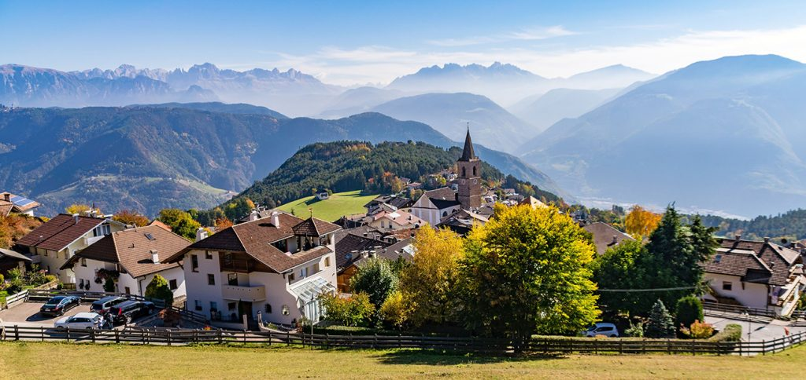

## Il vuoto a rendere

Mia mamma mi racconta dei tempi di quando era bambina, quando viveva in un **piccolo paese di montagna**. Mi racconta di come non facessero spesso la spesa, la maggior parte del cibo per nutrire una famiglia di 11 persone lo producevano in casa, erano contadini. Nel negozio locale prendevano il caffè e ogni tanto lo zucchero.Mi racconta come i succhi, l’olio e l’aceto e fossero contenuti in **bottiglie di vetro** che si riportavano una volta svuotate. 

Io mi ricordo di quando accompagnavo mia mamma a fare la spesa, **riportando la bottiglia di vetro** del latte. Davanti all’entrata del supermercato c’era una porta nera e minuscola, delle dimensioni della bottiglia di un litro. Io però, come tutti gli altri bambini del mondo, ero curiosa, curiosissima di quello che stava dietro. Mia mamma posava la bottiglia all’entrata della **porticella**, e questa, miracolosamente, veniva trasportata dietro una tenda nera. **Così la bottiglia sparì**. Immaginavo che dietro quella porta si aprisse un mondo fantastico, pieno di magia.

Più tardi scoprii che lì dietro c’era davvero un mondo fantastico: il mondo **del vuoto a rendere**. Il sistema del vuoto a rendere sta alla base dell’economia circolare del riutilizzo.   
La realtà di mia mamma era ed è ancora una realtà diffusa nella nostra regione. Il nostro territorio vive di agricoltura, abbiamo una scelta varia di **alimenti freschi**, tutti molto vicini. La **vicinanza** ci permette di sfruttare l‘occasione di non usare imballaggi che solitamente vengono usati nei trasporti di tanti chilometri. Dunque possiamo affermare che la **regionalità** dei prodotti è una componente importante se si parla di sostenibilità.

*Il **passato** ci ha insegnato come organizzare un sistema senza imballaggi che **oggi** possiamo adattare al nostro presente.*

I **dati attuali** ci mostrano che se in passato ci siamo appoggiati a decisioni a corto termine, adesso abbiamo bisogno di decisioni a lungo termine perché siamo alla soglia: La produzione di plastica monouso per il settore alimentare ha raggiunto 381 milioni di tonnellate a [livello globale](https://www.dataetc.org/2021/04/10/plastic.html) nel 2015; un peso equivalente a circa **[65](https://www.themeasureofthings.com/results.php?comp=weight&unit=tns&amt=50000000) volte la Grande Piramide di Giza**. Il riutilizzo, invece, è una decisione a lungo termine. Ecco cosa significa sostenibilità. 

Un’idea che va di pari passo con il riutilizzo è il **risparmio**. Ciò significa usare gli oggetti già posseduti fino in fondo prima di passare alla variante più **sostenibile**. Il principio di base è quello di non sprecare risorse ancora utili. 

  
**[Decisioni a lungo termine](/faq)** possono essere la chiave: solo così vissero tutti felici e contenti.

