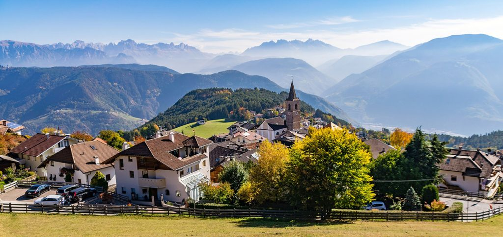

## Die Pfanderstattung

Meine Mutter erzählt mir von der Zeit als sie noch ein Kind war, als sie in einem **kleinen Dorf in den Bergen** wohnte. Sie erzählt mir, wie sie nicht oft den Einkauf machte, da ihre elfköpfige Familie den Großteil des Essens selbst produzierte: sie waren Bauern. Im lokalen Geschäft kauften sie Kaffee und manchmal auch Zucker. Sie erzählt mir, wie Saft, Öl und Essig in **Glasflaschen** enthalten waren, die zurückgebracht werden sollten, sobald sie leer waren.

Ich erinnere mich wie ich meine Mutter in den Supermarkt begleitete, wobei wir die **Milchflasche aus Glas** zurück brachten. Vor der Eingang des Supermarktes stand eine klitze kleine schwarze Tür so gross wie die ein Liter Flasche. Ich dagegen, wie auch alle anderen Kinder der Welt, war sehr neugierig, und ich wollte wissen was sich dahinter befand. Meine Mutter stellte die Flasche am Eingang der **kleinen schwarzen Tür** ab, und sie wurde, wie ein Wunder, hinter einen dunklen Vorhang transportiert. **So verschwand die Flasche**. Ich malte mir aus, wie sich hinter dieser kleinen schwarzen Tür eine fantastische Welt voller Magie aufschloss.

Später erfuhr ich, dass sich hinter der kleinen schwarzen Tür wirklich eine fantastische Welt befand: **die Pfanderstattung**. Das System der Pfanderstattung  bildet die Basis für die zirkuläre Wirtschaft der Wiederverwendung.

Die Realität meiner Mutter war und ist in unserer Region viel verbreitet. Wir leben von Landwirtschaft, die es uns erlaubt, jeden Tag **frische und regionale Lebensmittel** zu genießen. Die geografische Nähe zu den Produkten gibt uns die Möglichkeit, auf **Einwegverpackung** zu verzichten, die normalerweise für lange Transporte gebraucht wird. Daraus können wir schließen, dass **Regionalität** eine wichtige Komponente der Nachhaltigkeit ist.

*Die **Vergangenheit** lehrt uns, wie wir ein System ohne Einwegverpackung organisieren können, wir passen es an unsere **Gegenwart** an.*

**Aktuelle Daten** zeigen uns, dass wir uns gestern noch auf kurzfristigen Entscheidungen stützten und deshalb heute langfristige brauchen, wir sind nämlich an der Grenze: Die jährliche Produktion von Einwegplastik hat im Jahr 2015 die 381 Millionen Tonnen auf [globaler Ebene](https://www.dataetc.org/2021/04/10/plastic.html) erreicht; der Wert entspricht etwa **[65](https://www.themeasureofthings.com/results.php?comp=weight&unit=tns&amt=50000000) Mal dem Gewicht der Großen Pyramide von Gizeh**. Auf der anderen Seite gibt es die Wiederverwendung, eine langfristige Entscheidung. Das impliziert Nachhaltigkeit.

Ein Konzept, das die Wiederverwendung begleitet ist das **Sparen**. Dies bedeutet, Dinge bis zum Schluss zu benutzen und nicht vorzeitig in den Müll zu schmeißen, bevor man zur **nachhaltigeren Variante** wechselt. Der Grundgedanke ist, nicht brauchbare Ressourcen zu verschwenden.

**[Langfristige Entscheidungen](http://irefill.it/faq)** können die Antwort sein: nur so lebten sie glücklich und zufrieden bis an ihr Lebensende.

