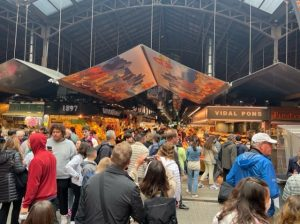

Ich habe mich oft gefragt, wie mein Bruder kein Fleisch essen kann, und ich dachte, dass es für mich unmöglich wäre. Aber jetzt, da ich die gleiche Entscheidung wie er getroffen habe, verstehe ich zumindest teilweise die Gründe für seine Veränderung.
### ***Wie es vorher war***

Jetzt, wo ich 15 Jahre alt bin, kann ich die Welt besser verstehen und weiß, was mein Bruder mir immer erklärte. Eine kleine Handlung wie der Verzicht auf Fleisch machte für mich keinen Unterschied, während es für meinen Bruder wichtig war. Wir haben viel gestritten und ich wollte meine Meinung nicht ändern. Dann änderte sich etwas und die erste ***Erkenntnis*** kam.
Seit einigen Jahren ***diskutieren*** wir in der Schule und in meiner Familie über die Frage: "Schadet Fleisch wirklich unserem Planeten?” Die Antworten, die ich erhielt, waren jedoch sehr unterschiedlich, und ich stellte fest, dass die meisten Menschen dazu neigen, "Ausreden" zu finden, mit denen sie mit sich selbst im Reinen sind, während sie die mit dem Fleischkonsum verbundenen Probleme vernachlässigen. Ich unterschied mich nicht von ihnen.
### ***Die Sensibilität***

Ich habe ***mich oft geweigert*** zu sehen, was hinter der Produktion von Fleisch steckt. Im Laufe der Zeit habe ich jedoch mit großem Bedauern festgestellt, dass der Planet, auf dem wir leben, ***durch uns schwer geschädigt*** wird. Der Gedanke, dass diejenigen, die nach mir kommen, nicht mehr in der Lage sein werden, die Wälder in meinem Tal so zu sehen, wie sie einst waren, die Gletscher, die schmelzen, und die Landschaft, wie sie war, als ich geboren wurde, machte mich sehr traurig und machtlos. "Es gibt nichts, was ich tun kann, um die Erde zu retten", habe ich mir oft mit Bedauern gesagt. Wenn die Weltinstitutionen nicht eingreifen, hat das, was wir auf unsere eigene kleine Art und Weise tun können, nur begrenzte positive Auswirkungen.
### ***Die Reise***

Nach dieser Zeit in der dritten Mittelschulstufe, in der ich sehr darauf bedacht war, Neues über die Klimakrise zu lernen, folgte eine Zeit, in der ich Klimathemen vernachlässigte. Erst kürzlich, während einer Reise, die ich dieses Jahr mit meiner ganzen Familie nach Barcelona unternommen habe, habe ich ***mich wirklich verändert***.
### ***Der Funken***

An einem Morgen in Barcelona machte ich mit meiner Familie einen Rundgang über den wichtigsten Markt der Stadt, den ***Boqueria-Markt*** an der Rambla. Auf den ersten Blick war es ein sehr interessanter und malerischer Ort, und die meisten Produkte, die an den Ständen verkauft wurden, waren lose und lokal. Der Laden war sehr voll und es gab alle möglichen Produkte. Was mich jedoch ***schockierte***, war der Anblick der Körper von Tieren, die unkenntlich gemacht wurden, weil sie zerrissen waren, nach dem Schlachthof nun für den Verkauf vorbereitet werden mussten. Diese Worte sind sehr blutig, aber sie dienen dazu, Ihnen die Härte eines solchen Bildes zu verdeutlichen. In diesem Moment wurde mir alles zu viel, die Stimmen der Menschen, das Brutzeln des Öls in den Pfannen, die Nähe zu den Menschen erstickten mich, die Mischung der Essensgerüche machte mich krank, und ich musste einfach raus.

### ***Man vergisst nicht***

Von diesem Moment an habe ich ***nie*** ***vergessen***, was ich sah, und die Frage, die ich mir stellte, als ich den Markt verließ, lautete: "Willst du wirklich auch dazugehören?", und meine Antwort war ***NEIN***. Von diesem Moment an beschloss ich, kein Fleisch mehr zu essen, weil ich nicht mehr bereit bin, nur für meine Ernährung arme Tiere töten zu lassen. Noch dazu, habe ich viele ebenso gute Ersatzprodukte für Fleisch gefunden. Ich setze also meinen Weg fort und versuche, die Menschen um mich herum darauf aufmerksam zu machen, denn diese Entscheidung, selbst wenn wir sie nur im Kleinen treffen, kann eine Kettenreaktion auslösen.
### ***Und nun?***

Es ist etwa zwei Jahre her, dass ich mich für die Klimakrise interessiert habe, und erst jetzt merke ich, dass ich mich wirklich verändert habe. Erst wenn man zurückblickt und die Banalität der Argumente erkennt, die man früher vorgebracht hat, kann man mit Sicherheit sagen, dass man nicht mehr der Mensch ist, der man einmal war.
*Es ist sehr wichtig, sich zu verändern, aber vor allem ist es wichtig, sich die Meinungen anderer Leute anzuhören, denn alles, was aus einer anderen Perspektive gesehen wird, kann uns dazu bringen, unser Denken zu ändern.*

 

