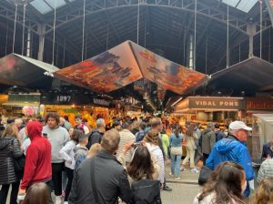

Tante volte mi sono chiesta come facesse mio fratello a non mangiare carne, e pensavo che per me sarebbe stata una cosa impossibile. Ora però che anche io ho fatto la sua stessa scelta capisco almeno in parte le motivazioni che lo hanno spinto a cambiare.
### ***Come era prima***

Adesso ho 15 anni, riesco a capire meglio il mondo e quello che mio fratello mi diceva. Una piccola azione come non mangiare la carne, non faceva la differenza per me, mentre per mio fratello era una cosa importante. Abbiamo discusso molto e non volevo sentir ragione. Poi qualcosa è cambiato  dentro di me e la prima presa di ***consapevolezza*** è arrivata.

Da alcuni anni sia a scuola sia nel mio ambito familiare abbiamo iniziato a ***dibattere*** su un quesito: “La carne nuoce davvero al nostro pianeta?”. Le risposte che ho ricevuto però sono state molto varie e ho notato che la maggior parte delle persone tende a trovare “*scusanti*” grazie alle quali possono stare in pace con se stessi trascurando i problemi legati al consumo di carne, e io non ero diversa da loro.
### ***La sensibilità***

Io ***rifiutavo*** spesso di vedere cosa c’è dietro alla produzione di carne.  Poi mi sono resa conto con estremo dispiacere che il pianeta su cui stiamo vivendo sta subendo ***gravi danni a causa nostra***. Pensare che chi verrà dopo di me non potrà più vedere i boschi della mia valle com’erano una volta, i ghiacciai che si stanno sciogliendo, e il paesaggio come era quando io sono nata, mi ha messo tristezza. “Io non posso fare nulla per salvare la Terra” mi sono detta spesso con dispiacere.
### ***Il viaggio***

Dopo questo periodo in terza media durante il quale mi sono preoccupata molto di imparare nuove cose sulla crisi climatica, è seguito un periodo di tempo in cui ho trascurato le questioni climatiche. Solo di recente, durante un viaggio fatto quest’anno con tutta la mia famiglia a Barcellona, ***sono cambiata*** veramente.
### ***La scintilla***

Una mattina a Barcellona sono andata con la mia famiglia a fare un giro dentro al mercato più importante della città, quello della ***Boqueria*** lungo la Rambla. A primo impatto mi è sembrato un posto molto interessante e caratteristico, la maggior parte dei prodotti che le bancarelle vendevano erano sfusi e del luogo. Lo stabilimento era molto affollato e c’erano prodotti di ogni genere. La cosa che mi ha ***sconvolta*** è stato però vedere i corpi di animali resi irriconoscibili perché dilaniati, erano stati al macello e adesso dovevano essere preparati per essere venduti. Queste parole servono per far capire la durezza di un’immagine così. In quel momento tutto ha cominciato a diventare troppo per me, le voci della gente, lo sfrigolare dell’olio nelle padelle di chi cucinava, la vicinanza con le persone mi soffocava, il misto degli odori dei cibi mi nauseava, e sono dovuta uscire di corsa.

### ***Non si dimentica***

Da quel momento non ho più ***dimenticato*** quello che ho visto, e la domanda che mi sono posta quando sono uscita dal mercato è stata: “Vuoi veramente fare parte anche tu di tutto questo?”, e la mia risposta è stata ***NO***. Da quel momento ho deciso che avrei smesso di mangiare carne perché no, io non ci sto più a far ammazzare dei poveri animali solo per fare mangiare me, anche perché ho trovato molti sostituti altrettanto validi alla carne. Perciò ora continuo sulla mia strada, cercando di far acquisire consapevolezza anche alle persone che mi stanno attorno, perché questa scelta, anche se fatta nel nostro piccolo, può innescare una reazione a catena.
### ***E adesso?***

Sono passati circa due anni da quando ho iniziato a interessarmi alla crisi climatica, ed è solo ora che mi rendo conto di essere cambiata veramente, . È solo quando ci si guarda indietro e ci si rende conto della scarsa lungimiranza dei ragionamenti che si facevano una volta che si può dire con sicurezza di non essere più la persona che si era prima.

*È molto importante cambiare, ma soprattutto è importante ascoltare pareri di persone diverse, perché tutto visto da un’altra prospettiva può farci cambiare pensiero.*

