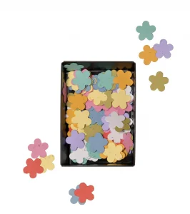
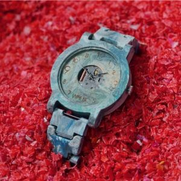
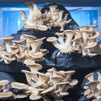
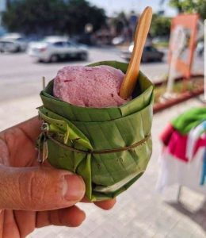

È nella nostra **natura umana** trovare problemi e volerli risolvere. Questo processo è alla base della creatività e, in effetti, alcuni problemi importanti spesso portano a nuove invenzioni molto sorprendenti. Personalmente, trovo la **risoluzione dei problemi e la creatività** estremamente interessanti, ed entrambe sono oggetto di numerosi studi di psicologia.

Il **cambiamento climatico** non fa eccezione a questo processo. In questo articolo voglio mostrarvi alcune **invenzioni** che riguardano la protezione dell'ambiente, ma in **modo molto curioso**. Penso che siano davvero interessanti, quindi lasciate che vi contamini.

 

### Throw and Grow

I coriandoli sono utilizzati in diverse occasioni di festa e la loro utilità risiede nella gioia di lanciarli. Ma l'utilità finisce lì. 

I coriandoli Throw and Grow sono fatti di carta colorata con all'interno **semi di fiori selvatici**. Una volta gettati in natura, la carta si decompone e i semi regalano un secondo momento di festa settimane dopo il lancio dei coriandoli: spuntano i fiori. La **celebrazione** diventa **sostenibile**.

[Niko Niko](https://www.nikoniko.nl/pages/instructions) è il nome dell'azienda olandese che significa "**sorriso**" in giapponese. Il loro obiettivo è quello di diffondere la felicità attraverso la creazione di **regali piantabili**. Oltre ai coriandoli da lanciare e far crescere, ci sono altri prodotti che portano gioia, ideali come caloroso regalo, e possono essere acquistati online.

 

### Dalla plastica agli orologi e alle sedie

[Precious Plastic](https://preciousplastic.com) è cresciuta da un'idea di riciclo al Precious Plastic Universe. I fondatori hanno sviluppato macchine che permettono di trasformare la **plastica** in nuovi oggetti utili, come mobili, materiale da costruzione o persino gioielli. Ora però arriva la parte decisiva. Offrono i loro prodotti a chiunque voglia contribuire alla risoluzione del problema della plastica aprendo una **stazione di raccolta**, uno **spazio di lavoro** o un **business di riciclaggio** nel proprio territorio.

Tutti possono essere **coinvolti attivamente** e anche molto creativi per quanto riguarda gli oggetti in cui vogliono che la plastica si trasformi. In questa maniera si può diventare parte del **Precious Plastic Universe**.

 

### Fondi di caffè che fanno crescere la vostra cena

Spinta dalla sostenibilità e dall'**amore per il buon cibo**, un'azienda austriaca ha iniziato a coltivare i suoi deliziosi **funghi ostrica** a partire da fondi di caffè, forniti dall'industria gastronomica. Ormai si sono sviluppati nella coltivazione urbana di funghi biologici. Nel periodo della pandemia hanno dovuto trovare un'alternativa ai fondi di caffè, perché l'industria gastronomica non riusciva più a vendere caffè (e quindi non produceva più i fondi di caffè). Sono passati alla **paglia biologica** e questo li ha portati a ottenere il certificato biologico. [Pilzkiste](https://www.pilzkiste.at) ha un negozio online e consegna a diversi ristoranti, negozi e supermercati in tutta l'Austria.

 

### La coppa di gelato verde

Alcuni anni fa una foto su Internet ha sorpreso positivamente le culture occidentali. La coppetta verde per il gelato è una **foglia di banano**, la foto proviene probabilmente dalla Thailandia. Sembra che in Thailandia sia abbastanza comune mangiare il gelato in una coppetta di foglia di banana, e in generale le **culture asiatiche** sembrano usare le foglie di banana per servire il cibo. Non si tratta quindi di un'invenzione completamente nuova, ma solo di una preziosa condivisione di **conoscenza tra culture** **diverse**. 

Il motivo alla base del piatto di foglie di banano arriva anche dal fatto che il calore del cibo fa sì che le foglie rilascino **antiossidanti** che si mescolano al cibo. Il risultato complessivo è un pasto condito da un piatto sano. [Ecco](https://www.wikihow.com/Eat-Food-on-a-Banana-Leaf) alcune indicazioni su come sperimentare a fondo un pasto servito su foglie di banano. 

 

Queste potrebbero essere invenzioni o abitudini inaspettate, ma credo che valga la pena **provarle**. Cosa ne pensate?

Non esitate a lasciare commenti sulla vostra esperienza o su altri modi interessanti per proteggere l'ambiente! **Ci piace imparare e condividere le conoscenze.**

