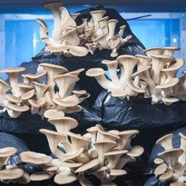
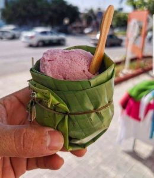

Es liegt in unserer **menschlichen Natur**, Probleme zu finden und sie lösen zu wollen. Dieser Prozess ist die Basis der Kreativität, und in der Tat führen einige große Probleme oft zu sehr überraschenden neuen Erfindungen. Ich persönlich finde **Problemlösung und Kreativität** äußerst interessant, und beide sind Gegenstand zahlreicher psychologischer Studien.
Der **Klimawandel** ist dabei keine Ausnahme. In diesem Artikel möchte ich euch einige **Erfindungen** vorstellen, die sich mit dem Umweltschutz befassen, allerdings auf eine sehr **kuriose Weise**. Lasst mich euch anstecken, ich finde sie nämlich richtig cool.

 
### Throw and Grow

Konfetti werden bei verschiedenen festlichen Anlässen verwendet, ihr Nutzen liegt in der Freude, sie zu werfen. Aber damit hört der Nutzen auch schon auf. 
Throw and Grow Konfetti bestehen aus buntem Papier mit **Wildblumensamen** darin. Sobald sie in die Natur geworfen werden, zersetzt sich das Papier und die Samen sorgen Wochen nach dem Wurf für einen zweiten festlichen Moment: die Blumen sprießen. Es wird also eine **nachhaltige Feier**.

[Niko Niko](https://www.nikoniko.nl/pages/instructions) ist der Name des Unternehmens aus den Niederlanden, er bedeutet "**Lächeln**" auf Japanisch. Ihr Ziel ist es, Freude zu verbreiten, indem sie **pflanzbare Geschenke** herstellen. Neben den Throw and Grow Konfetti gibt es auch andere freudige Produkte, die sich ideal als herzliches Geschenk eignen und online erworben werden können.

 
### **Von Plastik zu Uhren und Stühlen**

[Precious Plastic](https://preciousplastic.com) hat sich von einer Recycling-Idee zum Precious Plastic Universum entwickelt. Die Gründer haben Maschinen entwickelt, die es ermöglichen, **Kunststoff** in neue nützliche Gegenstände zu verwandeln, wie Möbel, Baumaterial oder sogar Schmuck. Jetzt kommt der entscheidende Teil. Sie bieten ihre Produkte jedem an, der bei der Lösung des Plastikproblems helfen möchte, indem er in seinem Gebiet eine **Sammelstelle**, ein **Workspace** oder ein **Recyclingbusiness** eröffnet.
Jeder kann sich **aktiv beteiligen** und auch sehr kreativ sein, wenn es um die Gegenstände geht, in die das Plastik verwandelt werden soll. So wird man Teil des **Precious Plastic Universums**.

 
### Kaffeesatz, der dein Abendessen wachsen lässt

Angetrieben von Nachhaltigkeit und der **Liebe zu gutem Essen** begann österreichisches Unternehmen, seine köstlichen **Austernpilze** aus Kaffeesatz zu züchten, der von der Gastronomie geliefert wurde. Mittlerweile haben sie sich zu einer urbanen Bio-Pilzzucht entwickelt. In der Zeit der Pandemie mussten sie eine Alternative zum Kaffeesatz finden, da die Gastronomie keinen Kaffee mehr verkaufte (und somit keinen Kaffeesatz mehr produzierte). Sie sind auf **Bio-Stroh** umgestiegen und konnten so ihr Bio-Zertifikat erlangen. [Pilzkiste](https://www.pilzkiste.at) hat einen Online-Shop und beliefert mehrere Restaurants, Geschäfte und Supermärkte in ganz Österreich.

 
### **Der grüne Eisbecher**

Vor einigen Jahren überraschte ein Bild im Internet die westlichen Kulturen positiv. Der grüne Becher für das Eis ist ein **Bananenblatt**, das Bild stammt wahrscheinlich aus Thailand. In Thailand scheint es durchaus üblich zu sein, Eis aus einem Bananenblattbecher zu essen, generell scheinen **asiatische Kulturen** Bananenblätter zum Servieren von Speisen zu verwenden. Es handelt sich also nicht um eine völlig neue Erfindung, sondern nur um eine wertvolle **Wissensvermittlung zwischen Kulturen**. 
 

Der Grund für den Bananenblattteller besteht unter anderem auch daraus, dass die Blätter durch die Hitze des Essens **Antioxidantien** freisetzen, die sich mit dem Essen vermischen. Das Gesamtergebnis ist eine Mahlzeit, die durch einen gesunden Teller abgerundet wird. [Hier](https://www.wikihow.com/Eat-Food-on-a-Banana-Leaf) findet ihr einige Hinweise, wie ihr eine auf Bananenblättern servierte Mahlzeit richtig genießen können. 

 

Dies mögen unerwartete Erfindungen oder Gewohnheiten sein, ich denke jedoch, dass es sich lohnt, sie **auszuprobieren**. Was haltet ihr davon?
Zögert nicht, eure Erfahrungen oder andere interessante Möglichkeiten zum Schutz der Umwelt zu kommentieren! **Wir lieben es, zu lernen und Wissen zu teilen.**

