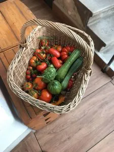

Chi di noi montanari non possiede un angolo di mondo? Nella nostra casa, nella prossimità dei boschi o addirittura un ultimo spazio verde tenuto avidamente contro il lento avanzare di case e cemento. Non c’è ne rendiamo conto forse, ma una cosa è sicura, abbiamo un compito importante: preservare e conservare questi ultimi avamposti della natura.

## C'era una volta...

I nostri avi, e sempre qui torniamo, utilizzavano ogni piccolo forma di terreno per coltivare e riuscire a ritagliarsi qualche prelibatezza in più sulla tavola di tutti i giorni. Ma adesso tocca a noi imparare da loro e a nostra volta replicare queste loro azioni, nonostante il supermercato sia la soluzione più veloce e comoda.

L’orto è da sempre stato fonte di vita fondamentale della gente di montagna, non possiamo abbandonare questa virtù secolare in un momento così delicato, dove l’abbondanza è un'illusione passeggera. Un’illusione che può essere inghiottita nel giro di una notte come è successo recentemente in Germania.

## Tutto di guadagnato

La verdura ma anche la frutta ricavate coltivando autonomamente, sono un guadagno netto, e non vengono tassate! Come ben si sa, nulla in questa vita è gratis e anche il reparto verdura non cresce da solo, ma ha bisogno di cura. Un’attenzione che non è difficile da imparare e nemmeno da mettere in pratica, giacché richiede poco tempo ma allo stesso modo grande costanza. Per chi ha già trovato il proprio angolo di mondo questa può essere un ottimo scopo!

## La cosa migliore

L’aspetto più bello e molte volte anche il più sottovalutato è l’assenza in sé di qualsiasi tipo di imballaggio! E se dovessimo proprio essere pignoli, l’unico involucro della frutta e verdura è spesso commestibile o altrimenti biodegradabile al 100%.

In questo modo ognuno di noi può contribuire almeno in parte a ridurre l’utilizzo di packaging monouso e allo stesso tempo avere prodotti freschi, a chilometro zero e con il gusto della propria fatica e soddisfazione.

La consapevolezza dell’importanza di questi spazi verdi e comuni si è riversata nella creazione di molte aree riservate in tutte le maggiori città Italiane. Continuiamo così e facciamo in modo di portare questo messaggio il più lontano possibile ed al maggior numero di persone!

