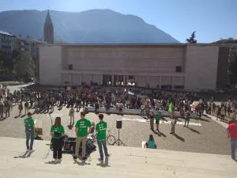

## Settimana numero 162 di sciopero

Questa è la notizia. Gli scioperi sono finalmente tornati nelle piazze, ma in realtà non si erano mai fermati. Ieri **24 Settembre 2021**, ragazzi e studenti di oltre 80 paesi hanno manifestato in tutto il mondo. Tutte le maggiori città di Italia sono scese nelle strade per chiedere **azioni concrete** (<https://fridaysforfutureitalia.it/>).

A Berlino i manifestanti erano oltre 100.000 ad ascoltare le parole di Greta. Numeri così non si erano visti dal lontano 2019. Il **20 settembre di due anni fa** si è stato registrato il più alto numero di manifestanti nella storia di Fridays For Future. Erano 250.000 le persone solo a New York, per un totale di 4 milioni in giro per il mondo. (<https://en.wikipedia.org/wiki/School_strike_for_climate>)

Anche quest'anno sono stati molti gli studiosi oltre che studianti a partecipare a quest'incontro. A Bolzano per esempio, **ricercatori dell'Eurac** (<https://www.eurac.edu/en>) hanno condiviso le loro esperienze e preoccupazioni, ma anche contadini impegnati nel biologico hanno voluto dare il loro contributo.

Una manifestazione **statica** di tutto rispetto che però secondo noi non è riuscita del tutto nella creazione di senso di appartenenza. Quell'emozione che deriva dal grande **corteo verde** che si articola per le vie della città rendendo partecipi tutti, volenti o nolenti.

## Cosa possiamo fare noi?

Contribuire ogni giorno è possibile e ognuno di noi dovrebbe saperlo. Possiamo ridurre il nostro consumo, coltivare un orto a casa, comprare **senza imballaggio** etc... Che siano scelte per la società, per famiglia, per se stessi. Ogni azione conta ed è importante avere una mentalità aperta e rispettosa dell'ambiente in cui viviamo.

Sono tutte cose che ci fanno sentire meglio perché effettivamente aiutano a minimizzare l‘impatto sul clima, ma hanno veramente un effetto positivo? Sì certo! Ma da sole non bastano. Proprio per questo abbiamo **bisogno dell'attivismo**. Le proteste sono un "tool" potente che abbiamo a nostra disposizione e dobbiamo usarla!

## Perché l’attivismo per il clima è importante?

Come ben sapete la nostra mission è quella di favorire uno **sviluppo sostenibile** e soprattutto zero waste, questo è necessario ma infatti non sufficiente. Per questo noi in primis sosteniamo le lotte di **fridays for future** e siamo convinti che soltanto mettendo pressione a governi e figure politiche sia possibile introdurre dei cambiamenti fondamentali.

Perché ormai è chiaro che, nonostante ognuno di noi faccia delle attività per ridurre il proprio impatto, senza una linea guida ben definita in ogni ambito della vita, non si raggiungeranno mai i risultati definiti nell'**accordo di Parigi del 2015**.

Durante la storia, come ha ricordato anche Giovanni Mori attivista di FFF Italia, chi scese nelle piazze riuscì ad **ottenere le proprie richieste**. Un esempio lampante può essere quello del voto alle donne in Europa o anche quello a Washington guidato da Martin Luther King ma la lista è ancora lunga...

In questo momento siamo proprio noi **giovani** che dobbiamo scrivere la storia, noi ragazzi dove il nostro soggiorno su questo favoloso angolo di universo è appena iniziato. Non ci resta altra scelta che stringere i denti e **continuare a lottare** per il nostro pianeta.

