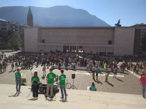

## Streikwoche 162

Dies sind die Nachrichten. Die Streiks sind endlich wieder auf die Straße zurückgekehrt. Gestern, am **24. September 2021**, demonstrierten junge Menschen und Studenten aus über 80 Ländern auf der ganzen Welt. Alle großen italienischen Städte gingen auf die Straße, um **konkrete Maßnahmen** zu fordern (<https://fridaysforfutureitalia.it/>).

In Berlin waren mehr als 100.000 Demonstranten anwesend, die Gretas Worte anhörten. Solche Zahlen gab es seit 2019 nicht mehr. Am **20. September vor zwei Jahren** wurde die höchste Zahl von Demonstranten in der Geschichte von Fridays For Future verzeichnet. Allein in New York waren es 250.000 Menschen, weltweit waren es insgesamt 4 Millionen. (<https://en.wikipedia.org/wiki/School_strike_for_climate>)

Auch in diesem Jahr nahmen zahlreiche Wissenschaftler und Akademiker an diesem Treffen teil. In Bozen zum Beispiel, tauschten **Forscher der Eurac** (<https://www.eurac.edu/en>) ihre Erfahrungen und Anliegen aus, aber auch Landwirte, die sich mit biologischem Anbau beschäftigen, wollten ihren Beitrag leisten.

Es handelte sich um eine **statische** Veranstaltung, der es unserer Meinung nach jedoch nicht ganz gelungen ist, ein Gefühl der Zugehörigkeit zu schaffen. Diese Emotion, die von der großen **grünen Prozession** ausgeht, die sich durch die Straßen der Stadt schlängelt und alle einbezieht, ob sie wollen oder nicht.

## Was können wir tun?

Es ist möglich, jeden Tag einen Beitrag zu leisten, und jeder von uns sollte das wissen. Wir können unseren Verbrauch reduzieren, zu Hause einen Gemüsegarten anlegen, **verpackungsfrei** einkaufen usw... Ob es sich um Entscheidungen für die Gesellschaft, für die Familie oder für uns selbst handelt. Jede Handlung zählt, und es ist wichtig, aufgeschlossen zu sein und die Umwelt, in der wir leben, zu respektieren.

All diese kleinen alltäglichen Dinge geben uns ein besseres Gefühl, weil sie tatsächlich dazu beitragen, unsere Auswirkungen auf das Klima zu minimieren. Aber sie allein reichen nicht aus. Deshalb **brauchen wir Aktivismus**. Proteste sind ein mächtiges "tool", das uns zur Verfügung steht, und wir müssen es nutzen!
## Warum ist Klimaaktivismus wichtig?

Wie ihr wisst, ist es unsere Mission, eine **nachhaltige Entwicklung** und vor allem die Abfallvermeidung zu fördern, was zwar notwendig, aber nicht ausreichend ist. Aus diesem Grund unterstützen wir die Anstrengungen von **Fridays for Future** und sind überzeugt, dass nur durch Druck auf Regierungen und Politiker grundlegende Veränderungen möglich sind.

Denn inzwischen ist klar, dass jeder von uns zwar etwas zur Verringerung unserer Auswirkungen tut, aber ohne klare Leitlinien für alle Lebensbereiche werden wir die im **Pariser Abkommen von 2015** festgelegten Ergebnisse niemals erreichen.

Wie der Aktivist des FFF Italien, Giovanni Mori, in Erinnerung rief, haben diejenigen, die auf die Straße gegangen sind, in der Vergangenheit ihre **Forderungen durchgesetzt**. Ein einleuchtendes Beispiel ist das Frauenwahlrecht in Europa oder das von Martin Luther King angeführte Votum in Washington, aber die Liste ist noch lang...

Im Moment sind es wir **junge Menschen**, die Geschichte schreiben müssen, wir, deren Aufenthalt in dieser fabelhaften Ecke des Universums gerade erst begonnen hat. Wir haben keine andere Wahl, als die Zähne zusammenzubeißen und weiter für **unseren Planeten** zu kämpfen.

