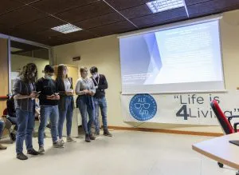
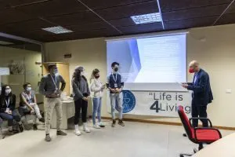

Vor mehr als sechs Monaten fand in Predazzo die erste Ausgabe des Val di Fiemme Climathon statt. (Wenn Sie mehr darüber wissen möchten, worum es dabei geht, gibt es [hier](https://irefill.it/climathon-val-di-fiemme-2021/) mehr dazu).

Anlässlich der Veröffentlichung eines Artikels über die Gewinner des Climathons in der Zeitung von Predazzo ( PREDAZZO NEWS ) möchten wir hier eine überarbeitete Version in digitalem Format präsentieren, die mehr Informationen über den Ablauf des Climathons und die von der Jury bevorzugten Ideen enthält.

Und los geht's!
## Die Herausforderungen

In diesem Jahr wurden zwei Herausforderungen vorgeschlagen: **"Nachhaltige Mobilität"** und **"Verhalten, Abfall und Kreislaufwirtschaft"**.

Die erste wurde von "[La sportiva](https://www.lasportiva.com/it)" unterstützt, die zweite vom [Geologischen Museum Predazzo](https://www.lasportiva.com/it). Es ging darum, die **Umweltverschmutzung zu verringern**: zum einen die Verschmutzung durch die vielen Arbeiter, die aus naheliegenden Gründen täglich aus dem **Industriegebiet nach Ziano** fahren, und zum anderen die **Verschwendung von Ressourcen zu vermeiden**, die ein neues Leben haben könnten. Die von MUSE gesponserte Herausforderung war sehr frei und der Kreativität waren keine Grenzen gesetzt, solange eine große Menge an Abfall auf innovative und geniale Weise aus dem Verkehr gezogen wurde. Jede Herausforderung ist mit einem Preis und einer Anerkennung verbunden, die unter der Leitung einer **Fachjury** vergeben werden. Die Jury bewertet die **Umsetzbarkeit** der Idee, die **Innovation**, aber auch die Art der **Präsentation und die Ausstrahlung** der Gruppe.
## Wie ist es gelaufen

### Die Arbeitsgruppen

Den ganzen Samstagnachmittag über arbeiteten die Teilnehmer in den verschiedenen Räumen des Stadio del Salto, wobei sie von Tutoren unterstützt wurden, die die **Zusammenarbeit** zwischen den Teammitgliedern förderten. Die Ausarbeitung der Projekte dauerte den ganzen Abend bis spät in die Nacht und am Sonntag. Es fehlte nicht an **Unterhaltungsmomenten** und Momenten des gemeinsamen Nachdenkens, vom Abendessen mit [Hero Burger & Delicious](https://www.heroburgerdelicious.it) über den Mitternachtssnack, der von [New Generation](https://www.crvaldifiemme.it/soci/newgeneration-fiemme/) (Vereinigung junger Mitglieder der Cassa Rurale) angeboten und zubereitet wurde, bis hin zu den **Wirtschaftsseminaren** mit **Carlo Dellasega** und **Daniele Berti** und dem abschließenden Aperitif bereitet vom Restaurant [Le Rais](https://www.tripadvisor.fr/Restaurant_Review-g656841-d23535196-Reviews-Ristorante_Le_Rais-Cavalese_Province_of_Trento_Trentino_Alto_Adige.html). Unseren Teilnehmern fehlte es also nicht an Energie und Ideen, um die Abschlusspräsentation zu bereichern. Doch damit nicht genug, auch die [Fleimstaler Bibliotheken](https://www.comunitavaldifiemme.tn.it/Il-Territorio/Luoghi-di-interesse2/Biblioteche) wollten ihren Beitrag leisten und richteten eine **wunderbare Leseecke** für Neugierige ein, mit einer eigens für die Veranstaltung erstellten Bibliographie.
### Die Präsentation

Am Sonntagnachmittag, als sie sich der Ziellinie näherten, mussten sich die Teams der Jury stellen, die den **6 Präsentationen** aufmerksam zuhörte und die besten Projekte auswählte. Die Jury bestand aus **Ettore Salgemma** (technischer Direktor von [Trentino Trasporti](https://www.trentinotrasporti.it)), **Daniele Berti** ([Confindustria](https://www.confindustria.tn.it/home)), **Alisia Tognon** und **Marco Marinelli** (Dozenten am [Politecnico di Milano](https://www.polimi.it/)) und **Lorenzo Gabrielli** (von der [Cassa Rurale di Fiemme](https://www.crvaldifiemme.it/privati/) ernannter Energieingenieur).
## Die Gewinnerideen

### Nachhaltige Mobilität - Gewinner

Der Preis für den Wettbewerb "Mobilität" ging daher an das **Team Zofeni** (Federica Braito, Leonardo Deville, Giorgia Vanzetta, Matteo Varesco und Giulia Zelgher), das die Idee für eine App namens **Zi.Ty - Ziano Mobility** hatte, mit der die Transportbedingungen für das Industriegebiet von Ziano verbessert werden sollen, in dem 10 Unternehmen mit insgesamt etwa 600 Beschäftigten angesiedelt sind. Es handelt sich dabei um eine integrierte **Mobilitätsplattform**, die es dem Arbeitnehmer ermöglicht, je nach seinen Bedürfnissen verschiedene Transportmöglichkeiten zu wählen, wodurch das Konzept der **"Mobility as a Service"** für uns alle eingeführt wird. Der Arbeitnehmer würde durch Prämien zur Nutzung der App angeregt, während das Unternehmen in Bezug auf das **Wohlbefinden** der Mitarbeiter, den **Stressabbau** und das Image profitieren würde.

### Verhalten, Abfall und Kreislaufwirtschaft - Gewinner

Der von MUSE in Predazzo unterstützte Wettbewerb "Verhalten, Abfall und Kreislaufwirtschaft" wurde vom **Team Ri-(pensa)menti fiemmesi** (Davide Kaus, Noemi Giuliani, Giovanni Giacomuzzi und Cecilia Doliana) gewonnen, das ein Projekt zur **Verringerung** der von Touristen in unseren Tälern verwendeten **Einwegplastikflaschen** konzipiert hat. Die Idee fand großen Anklang, weil sie transformativ ist, d. h. das Verhalten der Menschen verändert, und weil sie ein öffentliches Gut fördert, auf das wir sehr stolz sind. Das Konzept ist ganz einfach: Bei der Ankunft im Tal erhalten alle Touristen eine **abwaschbare Wasserflasche** aus plastikfreiem und regenerierbarem Material und werden eingeladen, diese mit unserem **köstlichen Leitungswasser** zu füllen. Brunnen werden auch als Erfrischungsstellen genutzt, die in die Wanderkarten aufgenommen werden können. Die Wasserflasche kann direkt von Hotels und B&Bs zur Verfügung gestellt werden, aber auch an anderen strategischen Punkten, um Touristen in Zweitwohnungen zu erreichen.

### Was haltet das MUSE davon?

Das [MUSE](https://www.muse.it/it/Pagine/default.aspx), der größte Unterstützer dieser Herausforderung, hatte sofort einen sehr guten Eindruck von dieser Herausforderung, denn **Wasser** ist nicht nur ein Konsumgut, sondern auch ein sehr **kostbares Gut** in unseren Bergen, wo es in großer Höhe nicht vorkommt und zu einer Rarität wird, der wir alle mehr Aufmerksamkeit schenken sollten. Eine Aufmerksamkeit, die heute noch nicht als so wichtig angesehen wird, die aber in den **nächsten 10 Jahren** eines der **Hauptprobleme** sein wird, nicht nur in den Höhenlagen, sondern überall auf der Welt: Städte, die mit Wasser **überflutet** sind, und immer mehr Orte, die von **Dürre und Mangel** betroffen sind, ganz zu schweigen von den ungewöhnlich häufigen und **heftigen Wasser- und Schneefällen**.
### Zusammenfassend

Nach all den vielen Ideen und der großen Motivation, die ich gehört habe, möchte ich wie der **Bürgermeister von Molina di Fiemme** abschließen, indem ich uns einige wertvolle Worte mit auf den Weg gebe, die ich immer bei mir tragen werde:

"In diesem Raum haben wir **mutige Ideen** gehört, die vor einer Jury präsentiert wurden; im Leben wirst du immer noch mit Menschen konfrontiert werden, die bereit sind, dich zu beurteilen, und wenn sie dich negativ beurteilen, darfst du deine Ideen nicht halbieren, sondern musst **nur deinen Mut verdoppeln**".

Bis zum **nächsten Jahr!**

