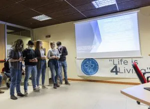
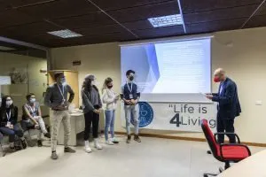

Ormai più di 6 mesi fa si è conclusa la prima edizione del Climathon della val di Fiemme tenutosi a Predazzo. (Se siete curiosi di sapere di più su che cosa si tratta il climathon, potete trovare più informazioni [qui](https://irefill.it/climathon-val-di-fiemme-2021/)).

In concomitanza con la pubblicazione di un'articolo su i vincitori del Climathon nel giornale di Predazzo ( PREDAZZO NEWS ) abbiamo voluto presentare qui una versione rivisitata in formato digitale, riportando più informazioni su come si è svolto il Climathon e quali sono state le idee preferite dei giudici.

Cominciamo subito!

## Le sfide

Le sfide proposte quest’anno sono state due: **“Mobilità sostenibile”** e **“Comportamenti, rifiuti e circolarità”**.

La prima sostenuta da [La sportiva](https://www.lasportiva.com/it), mentre la seconda dal [museo geologico di Predazzo Muse](https://www.muse.it/it/visita/Muse-sul-Territorio/Pagine/Museo-geologico-delle-Dolomiti-di-Predazzo.aspx). Il tema era quello di **ridurre l’inquinamento**: da un lato, l’inquinamento dell’enorme quantità di lavoratori che si sposta giornalmente dalla **zona industriale a Ziano** per ovvi motivi, dall’ altra **evitare lo spreco** di risorse che potrebbero avere una nuova vita. La sfida patrocinata da MUSE era molto libera e non c’era limite alla creatività, a patto che una grande quantità di rifiuti venga tolta dalla circolazione attraverso una modalità innovativa e geniale. Ad ogni sfida corrisponde un premio e riconoscimento che verrà assegnato sotto la guida di una **giuria di esperti**. La commissione valuterà la **fattibilità** dell’idea, **l’innovazione**, ma anche la maniera di **esposizione ed il carisma** del gruppo.

## Come è andata

### I gruppi di lavoro

Per tutto il pomeriggio del sabato, i ragazzi si sono messi al lavoro nelle varie sale dello Stadio del Salto, con l’aiuto di tutor che stimolavano la **cooperazione** tra i membri del team. L’elaborazione dei progetti ha richiesto tutta la sera fino a tarda notte e la domenica. Non sono mancati **momenti di svago** e di riflessione comune, dalla cena con [Hero Burger & Delicious](https://www.heroburgerdelicious.it), allo snack di mezzanotte offerto e preparato da [New Generation](https://www.crvaldifiemme.it/soci/newgeneration-fiemme/) (associazione dei giovani soci della Cassa Rurale), passando per **seminari** di economia con **Carlo Dellasega** e **Daniele Berti** assieme con l’apericena finale offerto dal ristorante [Le Rais](https://www.tripadvisor.fr/Restaurant_Review-g656841-d23535196-Reviews-Ristorante_Le_Rais-Cavalese_Province_of_Trento_Trentino_Alto_Adige.html). Ai nostri ragazzi non sono mancate dunque le energie né gli spunti per aggiungere punti alla presentazione finale. Come se non bastasse anche le [biblioteche di Fiemme](https://www.comunitavaldifiemme.tn.it/Il-Territorio/Luoghi-di-interesse2/Biblioteche) hanno voluto dare il loro contributo, allestendo, per i più curiosi, uno **stupendo angolo lettura** con una bibliografia ad hoc per l’evento.

### La presentazione

La domenica pomeriggio, giunti in prossimità del traguardo, i team si sono trovati ad affrontare la giuria, che ha ascoltato con attenzione le **6 presentazioni** e ha scelto i progetti migliori. La giuria era composta da **Ettore Salgemma** (direttore tecnico di [Trentino Trasporti](https://www.trentinotrasporti.it)), **Daniele Berti** ([Confindustria](https://www.confindustria.tn.it/home)), **Alisia Tognon** e **Marco Marinelli** (docenti al [P](https://www.polimi.it/it/)[olitecnico di Milano](https://www.polimi.it/)) e **Lorenzo Gabrielli** (ingegnere energetico designato da [Cassa Rurale di Fiemme](https://www.crvaldifiemme.it/privati/)).

## Le idee vincenti

### **Mobilità sostenibile - Vincitori**

Il premio per la sfida “Mobilità” è stato quindi assegnato al **team Zofeni** (Federica Braito, Leonardo Deville, Giorgia Vanzetta, Matteo Varesco e Giulia Zelgher), che ha delineato l’idea di un’app chiamata **Zi.Ty – Ziano Mobility**, pensata per migliorare le condizioni di trasporto verso la zona industriale di Ziano, che ospita 10 aziende per un totale di circa 600 lavoratori. Si tratta di una **piattaforma di mobilità** integrata che permetterebbe al lavoratore di scegliere diverse opzioni di trasporto, in base alla necessità del lavoratore, introducendo a tutti noi il concetto di **“Mobility as a Service”**. Il lavoratore viene incentivato all’utilizzo dell’app con dei bonus, mentre l’azienda ne trarrebbe vantaggio in termini di **benessere e riduzione dello stress** dei dipendenti e in termini di immagine.

### **Comportamenti, rifiuti e circolarità - Vincitori**

Per la sfida “Comportamenti, rifiuti e circolarità”, la sfida sostenuta da MUSE di Predazzo, è stata vinta dal **team Ri-(pensa)menti fiemmesi** (Davide Kaus, Noemi Giuliani, Giovanni Giacomuzzi e Cecilia Doliana), che ha concepito un progetto per **ridurre il numero di bottigliette di plastica monouso** utilizzate dai turisti nelle nostre valli.  L’idea è piaciuta molto perché è trasformativa, nel senso che porta a modificare i comportamenti delle persone, e perché valorizza un bene pubblico di cui noi andiamo molto fieri. Il concetto è semplice: al momento dell’arrivo in valle, viene consegnata a tutti i turisti una **borraccia lavabile**, fatta con materiale plastic free e rigenerabile, e invitarli a riempirla con la nostra **buonissima acqua di rubinetto**. Vengono sfruttate anche le fontane come punti di rifornimento che possono essere inseriti nelle mappe dei sentieri. La borraccia può essere fornita direttamente da Hotel e B&B, ma anche in altri punti strategici. 

### Che ne pensa il MUSE?

Il [MUSE](https://www.muse.it/it/Pagine/default.aspx), nonché il supporter numero uno di questa sfida, ha subito avuto un'ottima impressione riguardo a questa sfida, in quanto **l’acqua** non è solamente oggetto di consumo, ma anche un **oggetto molto prezioso** nelle nostre montagne, dove in alta quota non si trova e diventa una rarità per cui noi tutti dovremmo fare più attenzione. Un attenzione che oggigiorno non viene considerata così importante, ma che sarà uno dei **problemi principali**, non solo in alta quota, ma in tutto il mondo nei **prossimi 10 anni**: città **sommerse** d'acqua e sempre più luoghi con **siccità e carenze**, per non parlare delle inusuali cadute d’acqua e neve sempre più **frequenti e violente**.

### Per ricapitolare

Dopo aver sentito tutte queste numerose idee e tanta motivazione vorrei concludere allo stesso modo in cui il **Sindaco di Molina di Fiemme**, regalandoci delle parole preziose, che porterò sempre con me:

“In questa sala abbiamo sentito delle **idee coraggiose** presentate di fronte ad una giuria; nella vita vi troverete ancora di fronte a persone pronte a giudicarvi, e se vi daranno un giudizio negativo voi non dovete dimezzare le idee **ma solo raddoppiare il coraggio**”.

Ci vediamo **l’anno prossimo!**

