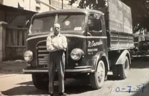
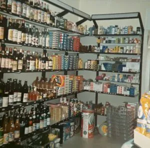

“***Correva l'anno 1950**. I miei genitori Virginio e Dolores ebbero l'idea di chiedere al Comune di poter aprire un **piccolo negozio** di vino d'asporto e generi alimentari. Avuta la licenza iniziarono i primi passi dell'attività in un locale di **pochi metri quadri**, posto in esercizio Via Salite, 1. L'attività fu intestata a mia madre: Bortolotti Dolores in Cavada*”

Così iniziano gli ultimi pensieri scritti da **mio nonno**. Sono passati molti anni ormai, ma solo ora sono venuto a conoscenza di questo **documento prezioso**, parte integrante del nostro paese e della **storia della mia famiglia**. I miei nonni hanno lavorato per gran parte della loro vita nel negozio di alimentari e generi vari, come si può leggere, e prima di loro ancora i miei bisnonni. Insomma è stata un’attività di famiglia che ha servito per **più di 3 generazioni** i miei compaesani. Leggendo queste parole si capisce con quali sforzi hanno portato avanti quest’attività per poter dare **sempre il meglio ai loro clienti**. 

### La vendita originale

Tra le molte informazioni che emergono dalle pagine una sicuramente riguarda **l’assenza di imballaggi** durante i primi anni di apertura. Un periodo in cui la maggior parte dei prodotti era **servita e venduta in maniera sfusa**. 

“***La merce era in prevalenza sfusa**: la pasta, la farina gialla e bianca, lo zucchero, i biscotti forniti in latte cubiche 2 del peso di circa 3 kg, che venivano coperte con un coperchio trasparente fornito dai biscottifici*. *Il vino si acquistava in damigiane da 50 It. , si vendeva sfuso; più avanti veniva **da noi imbottigliato**, etichettato e chiuso con tappo a corona.**(Un lavoro che mio nonno svolgeva molto volentieri.)"*

### Un servizio in più al cliente

Non solo questo, ma anche olio e caffè con altri prodotti venivano venduti direttamente senza confezioni monouso:

 “***Per la vendita dell'olio** furono acquistate due pompe con misuratore da 1⁄4 di lt-1/2 lt- 1 lt - una per l'olio di semi vari, una per l'olio d'oliva. In prevalenza si vendeva olio di semi, l'olio d'oliva era al tempo un prodotto extra*. *Fu acquistata una affettatrice a manovella; due silos per Il caffè che si vendeva in grani, e in secondo tempo un macinino elettrico per dare **un servizio in più al cliente**”*

Ho letto queste parole con grande stupore, sia per **l'organizzazione impeccabile**, ma soprattutto per la volontà di dare un “servizio in più al cliente” comprando un macinino elettrico. Un prodotto così scontato ai giorni nostri, ma allo stesso tempo così importante e **costoso allora**.

Il pensiero prosegue raccontando, di come il negozio si è evoluto e di come mio nonno, accompagnando mio padre a scuola, passava per Trento e acquistava le **verdure direttamente al mercato**, che faceva guadagnare non soltanto economicamente, bensì anche nella qualità e nella vicinanza ai produttori del territorio.

### L'investimento di tempo

*“**Il lavoro proseguiva abbastanza bene**, nonostante la concorrenza potevamo essere competitivi sul mercato, in quanto essendo privati **non si contavano le ore di lavoro**.”*

Questa frase raccoglie tutta l’essenza delle **fatiche e sacrifici** che i miei nonni, e prima ancora i bisnonni, hanno dovuto sopportare per riuscire a portare avanti questa impresa, **un'impresa eroica di fatto**. Una vita spesa per il lavoro e per dare “un servizio in più” ai loro clienti: **un’etica di grandissimo onore**.

Il negozio negli anni ha subito **molti cambiamenti** e ho potuto anche io vivere quest’esperienza per un breve periodo. Il nonno mi metteva alla cassa e facevo i conti per i **clienti più fidati**. Non mi dispiaceva, anche se il mio passatempo era scappare in ufficio a **giocare con il computer**. Mio fratello invece era le braccia del nonno. Era lui che portava le cose più pesanti e alcune volte portava anche la spesa ai **clienti più anziani**. Il negozio quando lo ho conosciuto io, era completamente diverso dallo stile iniziale, e anche il modo di vendere le cose era stato sostituito da lungo tempo con la **plastica e confezioni monouso**.

### L'attenzione all'ambiente

Una cosa che **ricordo con un sorriso** era la frutta, la verdura e il pane, che sono sempre stati consegnati in un sacchetto di carta: una **tradizione portata avanti negli anni**.

Immagino la fatica di portare avanti un’attività e nel contempo pensare alle **questioni ecologiche** ed ambientali, dopo tutto quello che avevano passato non sia stato **per nulla facile**. Per questo non posso lamentarmi che non sia stato fatto.

L’idea di iRefill è quella di riuscire a **condividere e trasmettere** l’importanza di tornare indietro cominciando ad utilizzare di nuovo strumenti e tecniche di vendita sfusa. Un nuovo modo di fare la spesa che però abbia sempre il **“servizio in più al cliente”** che i miei nonni hanno avuto a cuore da sempre.

