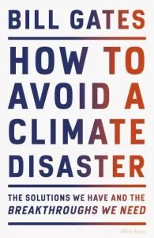

In questo articolo voglio parlarvi del libro [**"Come evitare un disastro climatico" di Bill Gates (2021)**](https://www.youtube.com/watch?v=zrM1mcKmX_c). Perché, chiedete? Voglio parlarvene perché fornisce una **panoramica molto chiara** della complessità del cambiamento climatico, di una strada esplicita da percorrere e della **complessità della sua soluzione**. È meglio dire, la composizione delle sue soluzioni. Come dice Gates, non abbiamo bisogno di una grande scoperta per risolvere il problema, ma di **molte scoperte** in molti settori diversi. In effetti, l'autore lo sottolinea all'inizio e diventa ancora più chiaro leggendo riga dopo riga: dobbiamo **cambiare quasi ogni aspetto** della nostra vita per vincere la sfida del cambiamento climatico. Dobbiamo adattarci e innovare per raggiungere l'obiettivo: **emissioni nette zero di gas serra entro il 2050**. 

Cosa significa emissioni nette zero? Significa che una quantità uguale di gas serra viene rimossa dall'atmosfera e rilasciata in essa, quindi la **rimozione annulla le emissioni**. Quanto può essere difficile? In un anno normale l'umanità emette **51 miliardi di tonnellate di gas serra**. Dobbiamo arrivare a zero, continuando a **soddisfare i bisogni fondamentali** del nostro pianeta. L'autore ha classificato i nostri bisogni fondamentali, che coinvolgono tutti i 51 miliardi di tonnellate di emissioni, come segue, con la corrispondente percentuale di emissioni:

A) Come **produciamo** le cose - **31%**

La produzione di **acciaio, cemento e plastica** provoca emissioni. Questi materiali sono utilizzati a livello più grande come nell'edilizia urbana, e a livello più piccolo come imballaggi. 

B) La **spina** - **27%**

**L'elettricità** si basa ancora principalmente su fonti di energia fossile. Con l'aumento della popolazione mondiale, **cresce la domanda** di elettricità. Questa domanda è ulteriormente aumentata dal passaggio dai combustibili fossili all'elettricità, soprattutto nei trasporti.

C) Come **coltiviamo** le cose - **19%**

**L'agricoltura animale** è responsabile delle emissioni rilasciate dal metabolismo degli animali. Inoltre, i **fertilizzanti** non sono esenti da emissioni.

D) Come ci **spostiamo** - **16%**

Il **trasporto individuale e pubblico**, ma soprattutto il **trasporto di merci** in nave o in aereo, necessita di innovazioni per azzerare le emissioni. L'elettricità e i biocarburanti avanzati sono promettenti.

E) **Riscaldarsi e raffreddarsi** - **7%**

I sistemi di riscaldamento e raffreddamento contengono **gas fluorurati** che contribuiscono alle emissioni di gas serra. I sistemi di **raffreddamento saranno più richiesti** a causa del riscaldamento del clima e in molti luoghi saranno quindi fondamentali.

A ciascuna categoria è dedicato almeno un capitolo di approfondimento su come sono composte le emissioni, come siamo arrivati a questo punto e **quali possibilità abbiamo** di eliminare tali emissioni. 

Queste sono le aree in cui dobbiamo lavorare per arrivare a zero. Come potete immaginare, insieme costituiscono quasi ogni aspetto della nostra vita quotidiana. La **nostra vita quindi cambierà**, ma speriamo in meglio e in modo più pulito. 

Come possiamo affrontare questi problemi? **Quali strumenti** abbiamo già e quali tecnologie dobbiamo sviluppare?

Gates riassume le tecnologie necessarie per avere successo, che possono essere classificate come segue:

Per A) **materiali a zero emissioni**: plastica, acciaio, cemento; perché dovremo continuare a costruire.

Per B) **produzione di energia pulita**: idrogeno, fusione nucleare, geotermia; perché la domanda sta crescendo e crescerà ancora di più dal momento che elettrifichiamo tutto e la popolazione mondiale sta crescendo.

**Stoccaggio dell'elettricità**, a causa dell'intermittenza della produzione di energia pulita (il vento non soffia sempre, il sole non splende sempre).

**Trasmissione elettrica sotterranea**, perché con la crescente domanda lo spazio in superficie diventerà molto poco.

Per C) **carne e latticini a base di piante e cellule**, perché l'agricoltura animale non è sostenibile e l'unico modo per continuare ad avere quei prodotti è fare questo passaggio.

**Fertilizzanti a zero emissioni**, perché hanno reso l'agricoltura mondiale molto più redditizia e sono quindi necessari, ma devono essere resi privi di emissioni.

**Alternative a zero emissioni all'olio di palma**, perché è necessario per la nostra produzione alimentare, ma non è a zero emissioni.

**Colture alimentari resistenti alle intemperie**, perché le condizioni climatiche diventeranno più rigide e dobbiamo adattare la nostra produzione alimentare ad esse.

Per D) **modi di trasporto a zero emissioni**.  

Per E) **accumulo termico** e **refrigeranti che non contengano gas fluorurati**.

Infine, una svolta fondamentale di cui abbiamo bisogno è la **cattura dei gas serra**. Per mantenere le nostre emissioni nette a zero è necessaria, poiché potrebbero esserci ancora delle emissioni. Inoltre, abbiamo molti **gas serra già emessi**.

Verso la fine del libro c'è un **capitolo dedicato alle politiche**. I nostri governi devono liberare la strada per imporre misure sostenibili a livello nazionale e internazionale, e soprattutto per consentire un'**efficiente collaborazione internazionale**. Questo capitolo è molto importante per ognuno di noi, perché possiamo influenzare le politiche attraverso **il nostro voto e il nostro attivismo**. I sostenitori, noi dobbiamo continuare a lottare per **rendere tutti responsabili** delle nostre azioni, individuali e collettive.

Se cerchiamo la soluzione, dobbiamo **conoscere il nostro problema**. Molto bene. 

Dopo aver letto il libro mi sento più familiare con il problema del cambiamento climatico. Mi sento più vicino alle soluzioni. **Non c'è un target specifico** di lettori per questo libro. **Questo libro è per tutti**. Perché tutti devono interessarsi al cambiamento climatico. Lo consiglio quindi assolutamente a tutti.

I messaggi più importanti trasmessi da Gates sono:

**Elettrificare** tutto.

**Votare** sostenibile.

Sciopero per la **giustizia climatica.**

La strada per ridurre le emissioni potrebbe essere diversa da quella per **azzerarle**. Dobbiamo arrivare a zero.

Quello che quindi possiamo fare è monitorare e **cambiare le nostre abitudini** da consumatori e da cittadini, con le azioni di ogni momento del giorno, con il modo in cui ci spostiamo, con il nostro voto e con il nostro impegno attivista. **Agiamo ora, sempre.**

