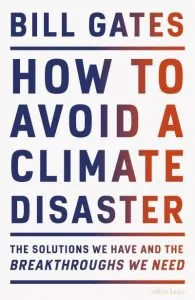

In diesem Artikel möchte ich euch das Buch [**"Wie wir die Klimakatastrophe verhindern" von Bill Gates (2021)**](https://www.youtube.com/watch?v=zrM1mcKmX_c) vorstellen. Warum fragt ihr euch? Ich möchte Ihnen davon erzählen, weil es einen sehr **klaren Überblick** über die Komplexität des Klimawandels, über einen eindeutigen Weg und über die **Komplexität seiner Lösung** gibt. Man sollte besser sagen, die Zusammensetzung der Lösungen. Wie Gates sagt, brauchen wir nicht einen großen Durchbruch, um das Problem zu lösen, sondern **viele Durchbrüche** in vielen verschiedenen Bereichen. Tatsächlich unterstreicht der Autor dies gleich zu Beginn und es wird beim Lesen von Zeile zu Zeile noch deutlicher: Wir müssen **fast jeden Aspekt unseres Lebens ändern**, um die Herausforderung des Klimawandels zu meistern. Wir müssen uns anpassen und innovativ sein, um das Ziel zu erreichen: **Netto-Null-Emissionen von Treibhausgasen bis 2050**. 

Was bedeutet Netto-Null-Emissionen? Es bedeutet, dass eine gleiche Menge an Treibhausgasen aus der Atmosphäre entfernt wird, wie sie in sie freigesetzt wird, so dass **die Entfernung die Emissionen aufhebt**. Wie schwer kann das sein? Nun, in einem normalen Jahr stößt die Menschheit **51 Milliarden Tonnen an Treibhausgasen** aus. Wir müssen auf Null kommen und gleichzeitig die **Grundbedürfnisse unseres Planeten befriedigen**. Der Autor hat unsere Grundbedürfnisse, die alle 51 Milliarden Tonnen Emissionen umfassen, mit dem entsprechenden Prozentsatz der Emissionen wie folgt kategorisiert:
A) Wie wir Dinge **herstellen** - **31%**
Die Herstellung von **Stahl, Zement und Kunststoff** verursacht Emissionen. Diese Materialien werden jedoch im Städtebau verwendet. 
B) **Stromanschluss** - **27%**
**Die Elektrizität** wird immer noch hauptsächlich aus fossilen Energiequellen gewonnen. Mit dem Wachstum der Weltbevölkerung **steigt auch die Nachfrage** nach Strom. Dieser Bedarf wird durch die Umstellung von fossilen Brennstoffen auf Elektrizität, insbesondere im Verkehrswesen, noch weiter erhöht.
C) Wie wir Dinge **anbauen** - **19%**
**Die Tierhaltung** ist für die Emissionen verantwortlich, die durch den Stoffwechsel der Tiere freigesetzt werden. Auch **Düngemittel** sind nicht emissionsfrei.
D) Wie wir uns **fortbewegen** - **16%**
Der **öffentliche und der Individualverkehr**, vor allem aber der **Transport von Gütern** per Schiff oder Flugzeug, erfordert Innovationen, um die Emissionen auf Null zu reduzieren. Elektrizität und moderne Biokraftstoffe sind vielversprechend.
E) **Warm** und **kühl** halten - **7%**
Heiz- und Kühlsysteme enthalten **F-Gase**, die für den Beitrag der Treibhausgasemissionen verantwortlich sind. **Kühlsysteme** werden wegen der Erwärmung des Klimas **stärker nachgefragt** werden, vielerorts werden sie daher von grundlegender Bedeutung sein.
Jeder Kategorie ist mindestens ein Kapitel gewidmet, in dem näher erläutert wird, wie sich die Emissionen zusammensetzen, wie wir an diesen Punkt gelangt sind und **welche Möglichkeiten** wir haben, diese Emissionen zu vermeiden. 
Dies sind die Bereiche, in denen wir arbeiten müssen, um auf Null zu kommen. Wie Sie sich vorstellen können, machen sie zusammen fast jeden Teil unseres täglichen Lebens aus. **Unser Leben wird sich also ändern**, aber wir hoffen, zum Besseren und Saubereren. 
Wie können wir diese Probleme angehen? **Welche Instrumente** stehen uns bereits zur Verfügung und welche Technologien müssen wir noch entwickeln?
Gates fasst die für den Erfolg erforderlichen Technologien zusammen, die sich wie folgt kategorisieren lassen:
Für A) **emissionsfreies Material**: Kunststoff, Stahl, Zement; denn wir werden weiterhin Dinge bauen müssen.
Für B) **saubere Energieerzeugung**: Wasserstoff, Kernfusion, Geothermie; denn der Bedarf steigt und wird noch weiter steigen, da wir alles elektrifizieren und die Weltbevölkerung wächst.
**Stromspeicherung**, weil die Erzeugung sauberer Energie nicht immer gleichmäßig verläuft (der Wind weht nicht immer, die Sonne scheint nicht immer)
**Unterirdische Stromübertragung**, denn mit der wachsenden Nachfrage wird der Platz an der Oberfläche sehr, sehr knapp werden.
Für C) **Fleisch und Milchprodukte auf Pflanzen- und Zellbasis**, weil die Tierhaltung nicht nachhaltig ist und die einzige Möglichkeit, diese Produkte weiterhin zu erhalten, darin besteht, auf diese Weise umzustellen.
**Emissionsfreie Düngemittel**, weil sie die Landwirtschaft auf der ganzen Welt viel rentabler gemacht haben und daher notwendig sind, allerdings müssen sie emissionsfrei gemacht werden.
**Emissionsfreie Alternativen zu Palmöl**, weil es in unserer Lebensmittelproduktion benötigt wird, aber nicht emissionsfrei ist.
**Witterungsbeständige Nahrungsmittelpflanzen**, da die Wetterbedingungen immer heftiger werden und wir unsere Nahrungsmittelproduktion daran anpassen müssen.
Zu D) **emissionsfreie Transportmittel.**   
Zu E) **Wärmespeicherung** und **Kühlmittel ohne F-Gase**.
Ein grundlegender Durchbruch, den wir brauchen, ist schließlich die **Treibhausgasabscheidung**. Um unsere Emissionen netto auf Null zu halten, ist dies erforderlich, da noch einige Emissionen übrig bleiben könnten. Außerdem haben wir eine Menge bereits **emittierter Treibhausgase.**
Gegen Ende des Buches gibt es ein **Kapitel, das der Politik gewidmet** ist. Unsere Regierungen müssen den Weg frei machen, um nachhaltige Maßnahmen auf nationaler und internationaler Ebene durchzusetzen und insbesondere eine **effiziente internationale Zusammenarbeit** zu ermöglichen. Dieses Kapitel ist für jeden von uns sehr wichtig, denn wir können die Politik durch **unsere Stimme und durch unseren Aktivismus** beeinflussen. Wir, die Befürworter, müssen weiter dafür kämpfen, dass wir alle für unser individuelles und kollektives Handeln **zur Rechenschaft gezogen** werden.
Wenn man nach der Lösung sucht, muss man **das Problem kennen**. Sehr gut. 
Nachdem ich das Buch gelesen habe, fühle ich mich mit dem Problem des Klimawandels vertrauter. Ich fühle mich den Lösungen näher. **Es gibt keine bestimmte Zielgruppe** für dieses Buch. Dieses Buch ist **für alle gedacht**. Denn jeder muss sich für den Klimawandel interessieren. Ich empfehle es daher unbedingt jedem.
Die wichtigsten Botschaften, die Gates vermittelt, sind:
**Elektrifiziert** alles.
**Wählt** nachhaltig.
Streik für **Klimagerechtigkeit.**
Der Weg zur Verringerung der Emissionen kann ein anderer sein als der Weg zum **Nullpunkt** der Emissionen. Wir müssen zu Null kommen. 
Was wir also tun können, ist, unsere **Gewohnheiten** als Verbraucher und als Bürger zu beobachten und zu **ändern**, und zwar in jedem Moment des Tages, durch unsere Bewegungen, durch unsere Stimme und durch unser aktives Engagement. **Handeln wir jetzt, immer.**

 

